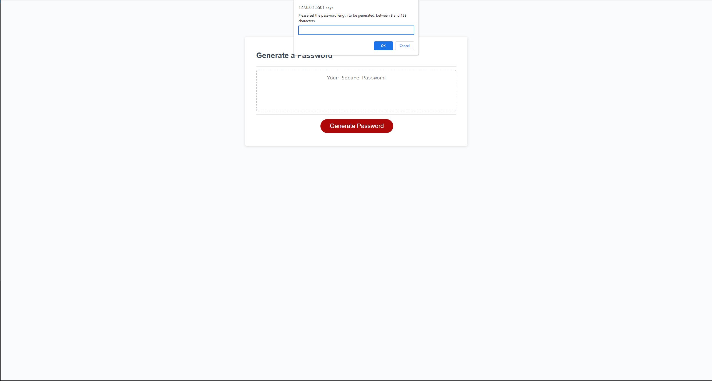
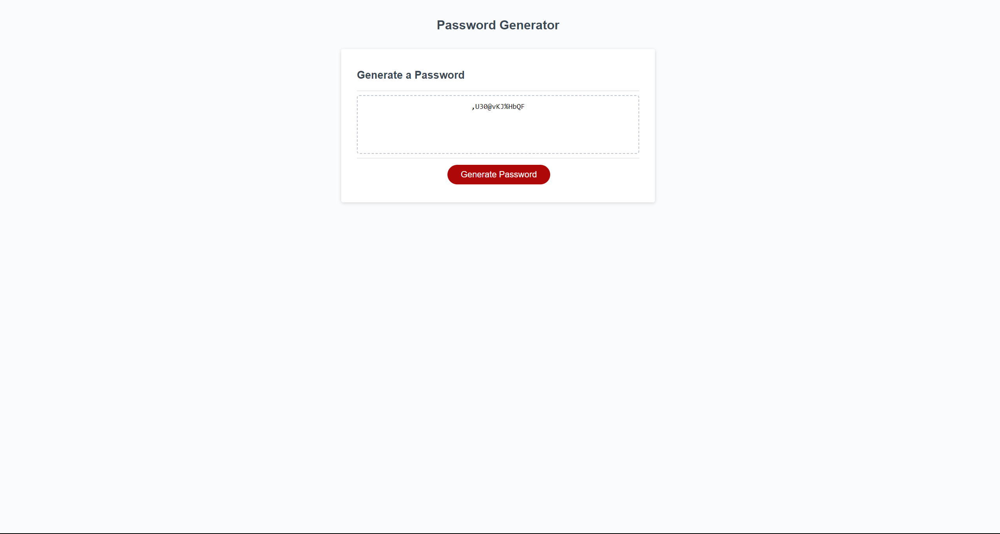

# Password-Generator (Module 3)

## Description

This application allows a user to generate a random passord, with the length of 8-128 characters. It also allows the user to customize the password with uppercase, lowercase, special and numerical characters.

URL: https://mdslva.github.io/Password-Generator/

## Credits

Completion of the project was done with the help of Tutors
